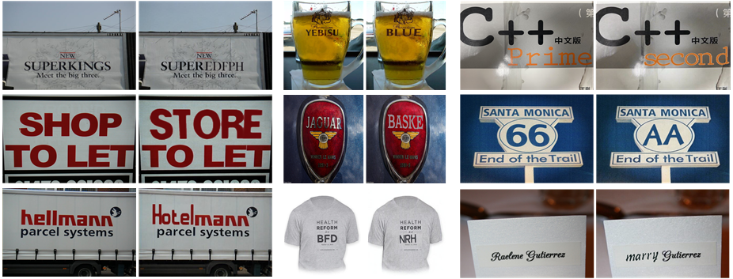
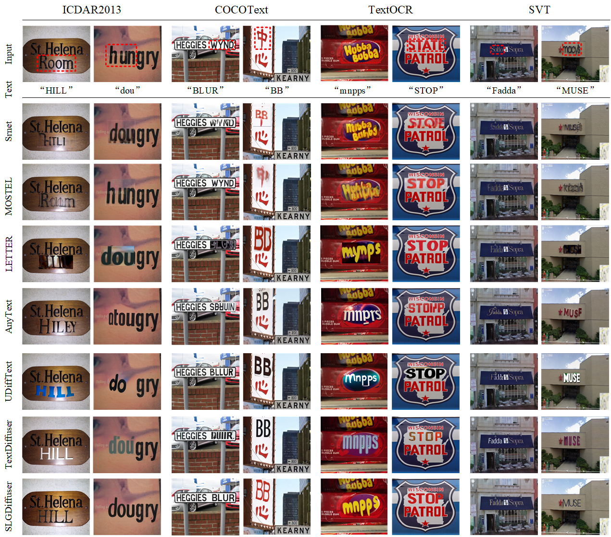

# SLGDiffuser

## Preparation

### 1.  Clone the repository
```bash
$ git clone 
$ cd SLGDiffuser
```
### 2. Create virtual environment
All code was developed and tested on Ubuntu 18.04 with Python 3.8.5 (Anaconda) and PyTorch 1.12.1.
```bash
$ conda env create -f environment.yaml
$ conda activate SLGDiffuser
```
### 3. Install dependencies
```bash
$ pip install -r requirements.txt
```

### 4.Datasets
#### Synthetic dataset
To get synthetic dataset from [SRNet](https://github.com/youdao-ai/SRNet-Datagen) . We used 800 fonts to generate 300,000 style images(i_s), plain text images(t_t), and corresponding mask images(mask_t) to train our SGTC module.
#### Real world dataset
The real data we used to fine-tune the UIBR module is stored in /data/. We show two kinds of fine-tuning data: real-world data with solid colors and real-world data with textures. Where img_origin is the original image, image_mask is the mask image of the area to be edited, and img_gen is the relatively good generation result we obtained with SD2 and complex descriptive prompt and used it as the ground truth for fine-tuning.

The download links for more test datasets are as follows: [ICDAR2013](https://paperswithcode.com/dataset/icdar-2013), [COCOText](https://paperswithcode.com/dataset/coco-text), [TextOCR](https://paperswithcode.com/dataset/textocr),[SVT](https://paperswithcode.com/dataset/svt).

### 5. Download pretrained models
Download the [trained models]([https://drive.google.com/file/d/1--VejuQEBgUExImv7KWMGFtlqYgoSPzG/view?usp=sharing](https://drive.google.com/drive/folders/19d5rNgJ6jDmqN3tBEIDlwamB3AEtjJes?usp=sharing) to `pretrained/`.
## Run codes

### Test models

Step1: The target text and the style of the text within the guide image, represented as $x_0$ and $m_0$, are generated through the Stroke-Level Guidance Text Conversion Module.
```bash
$ python step1_SGTC_infer.py --text YOUR_TARGET_TEXT --image_folder YOUR_IMAGE_PATH  --exp YOUR_OUTPUT_PATH --sample True
```

Step2: An image $x_{style}$ requiring scene text editing and a mask image $x_{mask}$ delineating the area to be edited are inputted, and the background-reconstructed image $x_{bc}$ is obtained using the Unified Instruction-based Background Reconstruction Module.
```bash
$ python step2_UIBR_infer.py --image_root YOUR_IMAGE_PATH --mask_root YOUR_MASK_PATH --save_root YOUR_OUTPUT_PATH 
```
Step3: Save the output  $x_0$ and $m_0$ of step1 to the output/text and output/text_mask directories respectively, and save the background reconstruction image  $x_{bc}$  obtained in step2 to the output/background directory. Save the mask image $x_{mask}$ of the area to be edited entered in step2 to output/background_mask, and execute the following code to get the final output.
```bash
$ python step3_CTFB.py 
```
## Results
### 1. Result for SLGDiffuser
<p align='center'></p>

### 2. Qualitative Results of Different Models 

<p align='center'></p>


## Contact

If you encounter any problems, please contact us.
## Reference
Our project borrows some source files from [DDIM](https://github.com/ermongroup/ddim) and [StableDiffusion](https://github.com/Stability-AI/StableDiffusion).
